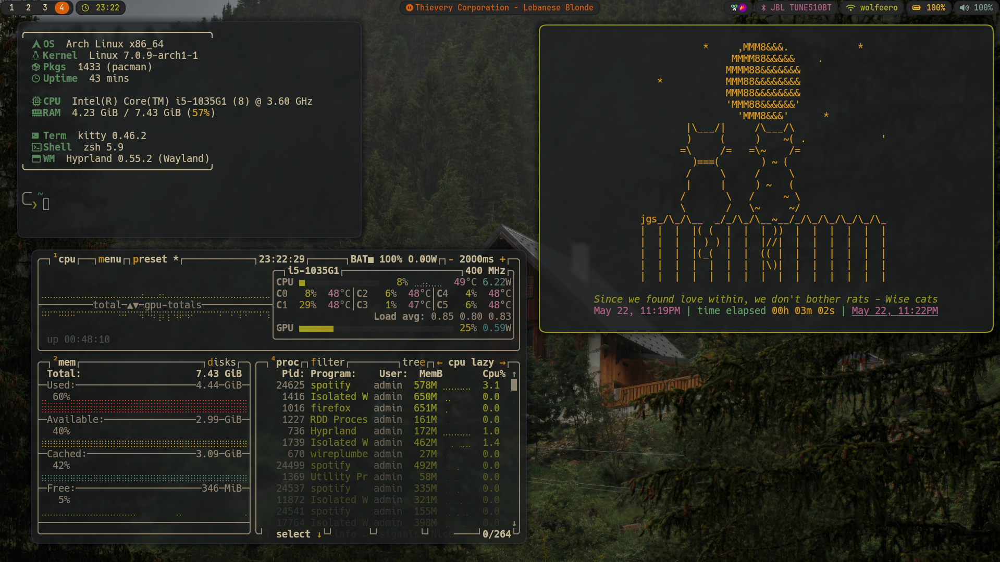

<h1 align="center">My Dotfiles</h1>

# Overview

- **Operating System**: `Arch Linux`
- **Window Manager**: `Hyprland`
- **Status Bar**: `Waybar`
- **App Launcher**: `rofi`
- **Terminal**: `Kitty`

## Appearance

- GTK Theme: [Gruvbox GTK Theme](https://github.com/Fausto-Korpsvart/Gruvbox-GTK-Theme)
- Color Palette: [Gruvbox palette theme](https://github.com/morhetz/gruvbox)
